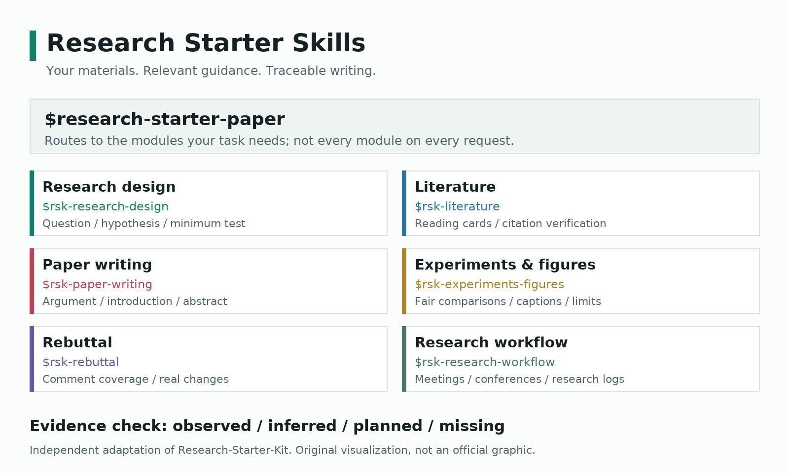

# Research Starter Skills

[中文](README.md) · [English](README_EN.md) · [版本记录](CHANGELOG.md)

[](https://github.com/YCC-Lover/research-starter-skills/actions/workflows/validate.yml)

**把研究材料变成有依据的论文表达，从你正在卡住的那一步开始。**

读了不少论文，却不知道引言怎么组织？已有实验结果，却说不清它支持什么结论？把草稿、文献和真实数据交给 Codex，让它按科研流程协助梳理问题、对应证据、修改章节，再列清下一步。

**[下载最新技能包](https://github.com/YCC-Lover/research-starter-skills/releases/latest) · [查看 16 个使用示例](examples/README.md) · [看场景与配图](examples/SHOWCASE.md) · [开始安装](#安装)**

本项目将 [LAMDA-NeSy/Research-Starter-Kit](https://github.com/LAMDA-NeSy/Research-Starter-Kit) 固定版本的 README 与全部 **19 篇教程**独立提炼为 **1 个总入口 + 6 个小 skill**，用于 Codex 的科研与论文写作协作。技能文件公开下载，安装脚本仅依赖 Python 标准库；运行任务仍需你自己的 Codex 环境及其可用工具。

**来源与归属：** 原项目 README 介绍人为郭兰哲，致谢陈煜旸、葛凌岳、张逸凯等同学。本仓库由 YCC-Lover 维护，是非官方独立提炼与 Codex 适配，不代表原作者认可。[逐篇来源](skills/research-starter-paper/references/sources.md) · [发布范围](NOTICE.md)。



图为本仓库原创示意，不是原教程截图；文字说明与更多图像见 [场景展示](examples/SHOWCASE.md)。

## 为什么值得试一次

- **不用从整篇论文开始。** 可以只改一段引言、检查一张图，或整理一条审稿回复。
- **知道要交付什么。** 研究卡、文献阅读卡、章节草稿、图注、回复覆盖表，按当前任务选择。
- **把证据边界写进流程。** 要求区分事实、假设和计划，缺失信息明确标注，不用流畅措辞掩盖证据缺口。
- **可以读懂，也可以修改。** 技能以 Markdown 文件保存，支持按学科调整；不绑定某个 Codex 账号。

适合刚开始做科研、正在写学位论文，或希望把零散研究材料整理成论证的研究者。原教程以 AI 科研为主，技能保留跨学科适用说明；材料、化学、工程等任务仍以你的学科语境和投稿要求为准。

## 从一个真实任务开始

安装后，在 Codex 中附上现有引言和研究材料，提出：

```text
使用 $rsk-paper-writing，帮我修改这份引言。
先检查“研究问题 -> 已有工作 -> 具体缺口 -> 本文回应”是否连贯，
再给出修改稿和简短修改说明。
保留现有引用、数值和学科术语；证据不足之处标为 [待补：具体信息]。
只处理引言，不扩展成全文写作。
```

不知道该选哪个模块时，使用 `$research-starter-paper`，让总入口根据材料选择相关小 skill。

| 你现在卡在哪里 | 可以先试什么 |
| --- | --- |
| 有方向，但题目太宽 | 将方向细化为问题、假设和最小验证计划 |
| 文献很多，关系不清 | 制作文献阅读卡，区分作者主张与证据 |
| 引言像文献堆砌 | 按问题、缺口、回应重建论证顺序 |
| 摘要空泛，贡献太满 | 根据已有方法和结果调整表述强度 |
| TG/DTG 等结果难写成段落 | 核对数据条件，再写观察、图注与解释边界 |
| 审稿意见不知从哪回 | 建立逐条回复与真实修改对应表 |
| 组会或参会准备零散 | 整理报告提纲、讨论问题与跟进草稿 |

[示例页](examples/README.md)包含 16 个场景的输入清单、完整提示词和交付目标，还演示了证据不足时如何改写。选一个与你最接近的任务，带着真实材料试一次。

**还没有适合分享的研究材料？** 可以先用 [随包教学材料](examples/demo-materials/README.md) 练习读表、图注和逐条回复。材料全部自行编写，曲线为合成数据，意见为虚构教学意见，不需要上传自己的未发表论文。

## 技能目录

| Skill | 用途 | 原教程 |
| --- | --- | --- |
| [research-starter-paper](skills/research-starter-paper/SKILL.md) | 跨阶段科研与论文任务的总入口 | 01-19 |
| [rsk-research-design](skills/rsk-research-design/SKILL.md) | 选题、问题、Idea、最小验证 | 01、04 |
| [rsk-literature](skills/rsk-literature/SKILL.md) | 找论文、读论文、引用与 BibTeX | 02、03、15 |
| [rsk-paper-writing](skills/rsk-paper-writing/SKILL.md) | 大纲、摘要、引言、相关工作、方法 | 08、10-13 |
| [rsk-experiments-figures](skills/rsk-experiments-figures/SKILL.md) | 实验设计、结果分析、论文图表 | 09、14 |
| [rsk-rebuttal](skills/rsk-rebuttal/SKILL.md) | 审稿回复与返修 | 16 |
| [rsk-research-workflow](skills/rsk-research-workflow/SKILL.md) | 汇报、meeting、参会、日志、资助、AI 协作 | 05-07、17-19 |

## 安装

本地安装仅需 Python 3.10 或更新版本，不需要额外 Python 包。

**不使用 Git：** 在 [最新发布页](https://github.com/YCC-Lover/research-starter-skills/releases/latest) 的 Assets 中下载 `research-starter-skills-v<版本>.zip`，解压后进入包含 `catalog.json` 的目录，运行 `python scripts/install_skills.py`。`SHA256SUMS.txt` 可用于核对下载文件的 SHA-256。

**使用 Git：**

```text
git clone https://github.com/YCC-Lover/research-starter-skills.git
cd research-starter-skills
python scripts/install_skills.py
```

默认安装到 `$CODEX_HOME/skills`；未设置 `CODEX_HOME` 时使用 `~/.codex/skills`。可用 `--dest <完整目录>` 指定另一个 Codex 用户目录。安装后在后续 Codex 对话中使用技能名称。

也可以在支持内置 `skill-installer` 的 Codex 中提出：

```text
请从 https://github.com/YCC-Lover/research-starter-skills 安装 skills/ 下全部七个 skill。
```

总入口需要六个小 skill 位于同级目录；建议一起安装。已有同名目录时，默认拒绝覆盖，不会删除任何文件。

安装前可执行 `python scripts/install_skills.py --dry-run`；已有安装可用 `python scripts/install_skills.py --check` 只读对比内容。完整路径、备份、失败处理和换账号说明见 [安装指南](docs/INSTALLATION.md)。

## 使用

小任务直接点名模块，跨阶段任务交给总入口。完整提示词和所需材料见 [使用示例](examples/README.md)。

```text
使用 $research-starter-paper，根据我的研究材料整理论文论证和写作计划。
使用 $rsk-paper-writing，修改我的引言，不改变事实和引用。
使用 $rsk-experiments-figures，根据真实数据检查实验分析和图表。
使用 $rsk-research-workflow，准备会议介绍、提问和会后跟进草稿。
```

技能区分已完成结果、假设和计划，不编造数据、引用、机制、审稿意见或已完成修改。原文中 AI 领域案例、句数、介绍时长、旧工具命令和资助条件都有适用说明，不能覆盖当前用户指令或投稿规范。

## 不同 Codex 账号

技能是文件，不绑定某个 Codex 账号。同机同一用户目录可继续使用；不同机器或用户目录需要重新安装。公开仓库可以直接读取，也可以 fork 或 clone 后让另一个 Codex 账号打开项目并按 [AGENTS.md](AGENTS.md) 修改。

Codex 登录与 GitHub 写入权限是两回事。推送到本仓库需要 GitHub 仓库的写权限；没有写权限时，可在自己的 fork 中修改并提交 Pull Request。不会把本机凭证、账号会话或 Codex 聊天随仓库发布。

## 修改与更新

修改 `skills/<名称>/SKILL.md` 和对应参考文件。来源变化时更新提炼位置与真实阅读状态，不能只改变覆盖数字。开发验证：

```text
python -m pip install -r requirements-dev.txt
python scripts/validate_skills.py
python -m unittest discover -s tests -v
```

自动检查覆盖格式、链接、映射、安装行为和隐私，不替代原文人工核对。安装更新需要显式指定备份目录：

```text
python scripts/install_skills.py --update --backup-dir D:\Codex\work\research-starter-skills-backups
```

该操作备份将被覆盖的文件，保留目标目录中的其他文件，不批量删除旧文件。Git 更新或 skill 修改不会自动同步已安装副本，验证后重新执行安装更新。

## 版本与来源

当前稳定版为 `v1.1.0`，首版为 `v1.0.0`；以 [catalog.json](catalog.json) 中的版本为准。可在 [GitHub Releases](https://github.com/YCC-Lover/research-starter-skills/releases/latest) 下载技能包或选择对应 tag，以固定版本安装。

覆盖对应上游提交 `36ba390d153f5289308ec833e2b633c26b304a7b`。外部致谢资料仅保留出处关系，未声称阅读其中的整本书。[完整来源表](skills/research-starter-paper/references/sources.md) 与 [NOTICE.md](NOTICE.md) 说明作者归属和发布范围。

这是非官方整理版，不包含原始 PDF、飞书登录信息、用户论文或实验数据。来源、适用性改写与逐篇映射保存在各 skill 的 `references/` 中。技能不能替代真实实验、作者判断、文献核验和投稿规范，也不承诺录用或固定的效率提升。

上游固定版本没有 LICENSE/COPYING 文件。此仓库不将上游标为 MIT 等许可，也不授予原教程、图片或品牌资产的转载权。

本仓库目前也未添加整体许可或原创素材许可；公开可读不等于已授予任意转载、商业使用或再许可权。引用本适配版可使用 [CITATION.cff](CITATION.cff)，同时注明上游项目来源；引用与许可是两回事。

## 质量与边界

自动检查技能格式、19 篇来源映射、相对链接、公开路径、安装更新及批准图像的完整性。新增回归测试覆盖优化模式下校验、链接目录与硬链接、无写入预览及内容对比。[本次审查记录](docs/PROJECT_AUDIT.md) 区分已验证事项与剩余风险。

这些校验不等于模型在所有学科都表现可靠。示例是任务模板与教学示意，不是准确率、节省时间或录用率证明；最终数据、引文与结论仍需作者核对。

## 觉得有用，欢迎一起完善

先 [下载技能包](https://github.com/YCC-Lover/research-starter-skills/releases/latest)，用你正在处理的一段文字、一份文献或一张图开始。需要时回来查看示例，不必一次学习全部模块。

欢迎 Star 收藏，方便下次找到；也欢迎通过 [Issues](https://github.com/YCC-Lover/research-starter-skills/issues) 提出缺失场景，或通过 Pull Request 补充示例。[贡献指南](CONTRIBUTING.md) 说明如何提交可复核的场景与纠错。反馈请使用脱敏材料，不上传未公开论文、实验数据或个人敏感信息。
