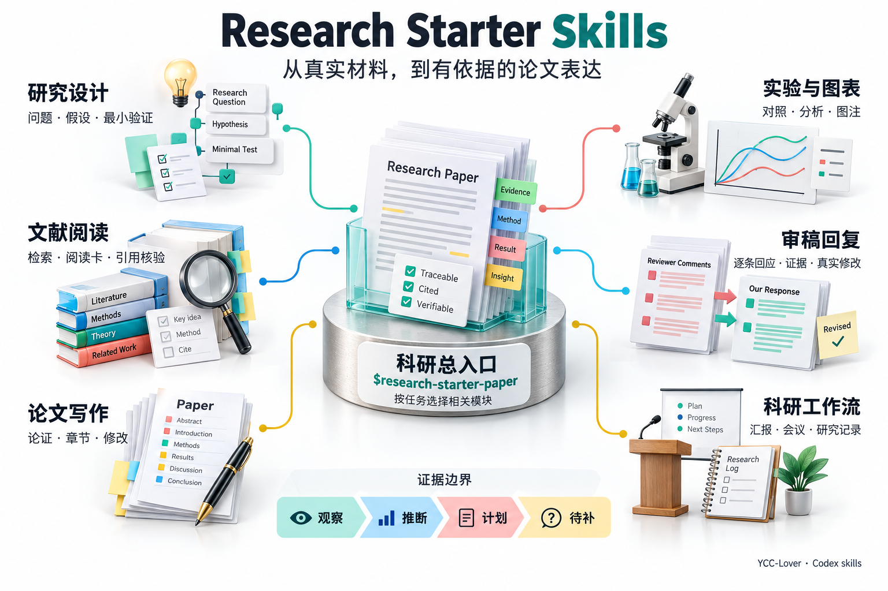
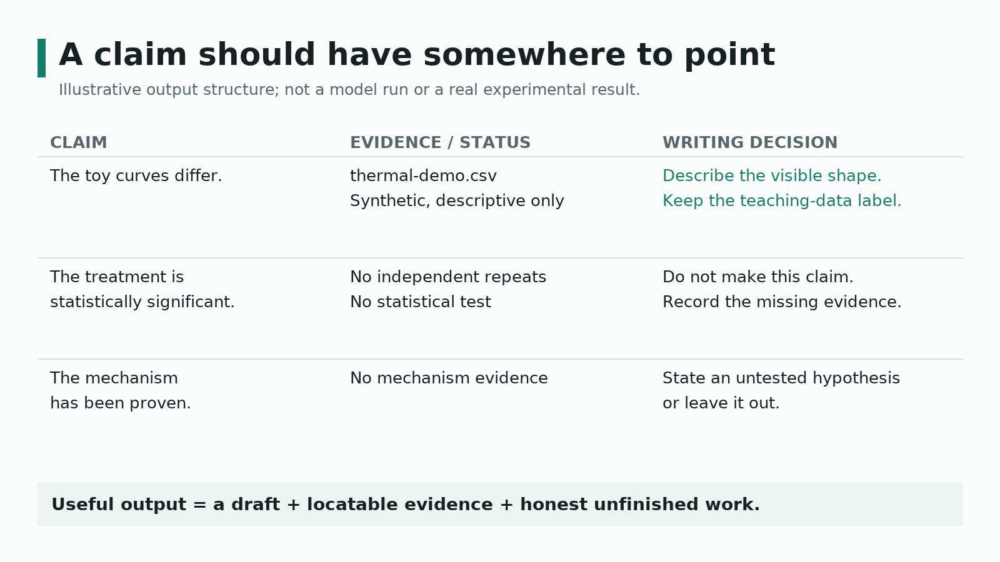
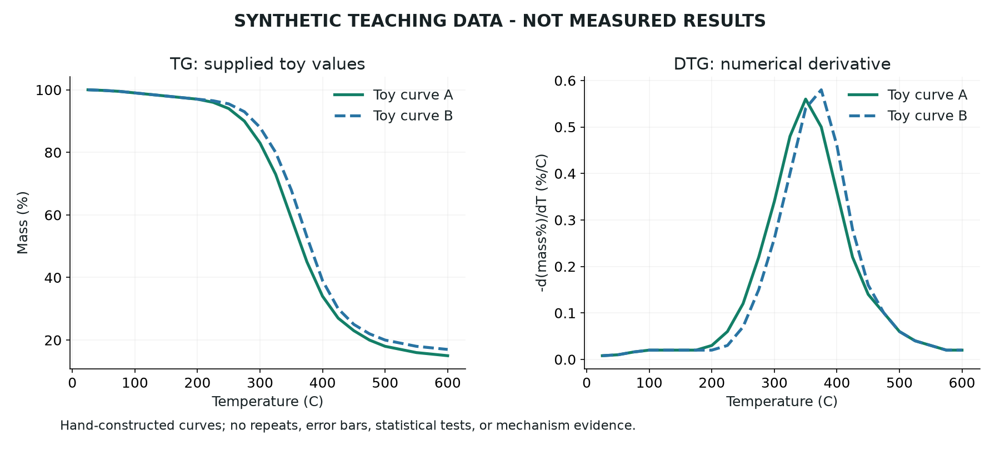

# 从输入到交付：三个展示场景

[返回首页](../README.md) · [19 个任务提示词](README.md) · [首次练习](first-run/README.md) · [随包教学材料](demo-materials/README.md)

本页是本项目独立制作、可核对的教学与产品展示。产品图使用 GPT-image 生成，其余图像由随包脚本绘制；这些图不是实际模型运行记录或研究者的实测结果。skill 的方法论来源为 [LAMDA-NeSy/Research-Starter-Kit](https://github.com/LAMDA-NeSy/Research-Starter-Kit)，图像与原教程分别归属。

## 场景一：不确定从哪个模块开始

**输入：** 已有研究笔记、草稿与证据，以及本次范围。

**过程：** 总入口识别任务，只读取相关模块；单段改写不强制启动全流程。

**交付目标：** 明确问题、可支持主张、所需稿件及影响结论的待补项。

文字版：总入口可协调研究设计、文献、论文写作、实验图表、返修回复和科研工作流；所有输出都要区别观察、推断、计划与缺失证据。

总入口与模块的连线表示按需选择，不要求每次执行全部模块。图中论文、仪器和曲线为概念插画，不对应用户的真实材料或数值。[生成说明与完整提示词](../docs/images/workflow-product.prompt.md)。

## 场景二：一句强结论应该保留吗

**输入：** 一句结论、对应证据文件与已完成分析。

**过程：** 分别核对观察、显著性与机制主张需要的证据，而不是统一把文字改得更强。

**交付目标：** 可以保留的表述、缺失支持和较保守的改写。

示意判断：教学曲线的形态可以描述；没有重复与检验不能声称统计显著；没有机制证据不能声称机理已证实。实际任务仍需检查原始数据是否真的支持所述观察。

## 场景三：TG/DTG 数据怎样对应图注和回复

**输入：** 随包的 [合成 CSV](demo-materials/thermal-demo.csv)、[教学笔记](demo-materials/research-notes.md) 和 [虚构审稿意见](demo-materials/reviewer-comments.md)。

**过程：** 科学作图工具读取固定 CSV；DTG 采用明确的数值求导定义，不另加平滑。回复必须保留“尚无真实重复实验”的状态。

**交付目标：** 带教学数据标签的图注、描述性观察、真实科研迁移时的缺项，以及未完成意见覆盖表。

两条曲线手工构造，仅展示数据到图的追溯关系，不代表处理效果、真实测量、统计证据或机理发现。各温度的采样点不是独立重复。

## 图像来源与复现

产品示意图使用 GPT-image 生成，[提示词](../docs/images/workflow-product.prompt.md)可用于重新创作，但不能保证相同像素与排版。下面的脚本只复现旧版模块图、主张与证据示意、合成 TG/DTG 图，不覆盖新的产品图，并保留其清单记录。

复现脚本绘图时，安装可选绘图依赖，然后运行：

~~~text
python -m pip install -r requirements-showcase.txt
python scripts/render_showcase.py --work-dir D:\Codex\work\rsk-showcase
~~~

Windows 中间文件按本机约定使用 D/E；其他平台把参数替换为明确允许的临时目录。图像最终写入仓库 docs/images，缓存只写入指定工作目录。读取、安装与使用 skills 本身不需要这些绘图依赖。

[图像清单](../docs/images/manifest.json)记录创建者、性质、生成脚本或提示词、数据来源、尺寸和 SHA-256。文字版说明提供无图环境的替代阅读。
